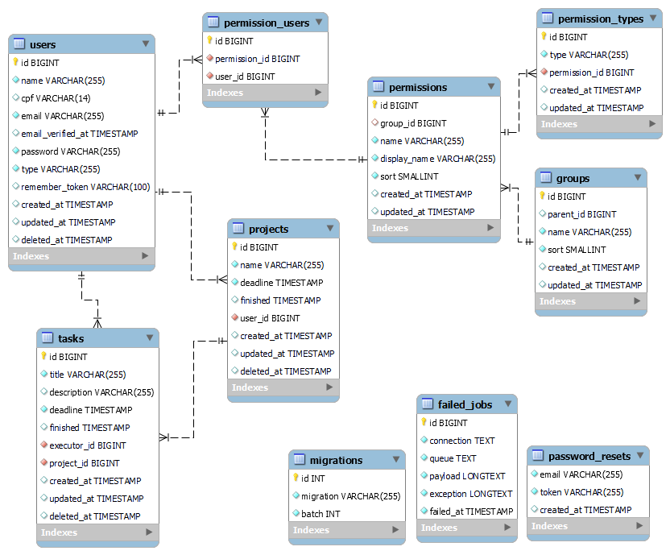

# Api REST Laravel

## Descrição

Este projeto tem como objetivo desenvolver uma API Restful para o gerenciamento de projetos e tarefas. Nele, os usuários são divididos em Super Admin, com acesso total ao sitema, gerentes, responsáveis por cadastrar os projetos, e executores, encarregados de realizar as tarefas. A API utiliza um sistema de Controle de Acesso (ACL) para gerenciar as permissões com base no tipo de usuário.

## Pré-requisitos para a instalação

- Laravel Framework 6.20.44
- PHP 7.4.33

## Instalação

Copie o arquivo “.env.example” dê no nome “.env” ao novo arquivo e faça a configuração do banco de dados.

Execute os comandos abaixo no termial:
- composer install
- php artisan jwt:secret
- composer dump-autoload
- php artisan migrate
- php artisan db:seed

## Execução

Execute o comando `php artisan serve` no terminal ou use um servidor ngnix ou apache.

## Usuários pré cadastrados

| tipo | e-mail  | Senha |
|--|--|--|
| Super Admin | super@admin.com | 123456 |
| Gerente Teste | gerente@teste.com | 123456 |
| Executor Teste | executor@teste.com | 123456 |

## Modelos

| Modelo | Atributos |
|--|--|
| User | id, name, cpf, email, email_verified_at, password, type, remember_token, created_at, updated_at, deleted_at |
| Project | id, name, deadline, finished, user_id, created_at, updated_at, deleted_at |
| Task | id, title, description, deadline, finished, executor_id, project_id, created_at, updated_at, deleted_at |
| Group | id, parent_id, name, sort, created_at, updated_at |
| Permission | id, group_id, name, display_name, sort, created_at, updated_at |
| PermissionType | id, type, permission_id, created_at, updated_at |
| PermissionUser | id, permission_id, user_id |

## Diagrama de Classes

## API

Para testar a API utilize o POSTMAN e importe a collection disponibilizada na raiz do projeto que possui o nome **api_rest_test.postman_collection.json**

## Rotas

Url base: http://localhost:8000/api

### Auth
| Descrição | Request | Endpoint | Parametros |
|--|--|--|--|
| Login | POST | /auth/login | email: string , password: string |
| Logout | POST | /auth/logout | |
| Refresh | POST | /auth/refresh | |
| Me | POST | /auth/me | |

### Usuários

| Descrição | Request | Endpoint | Parametros |
|--|--|--|--|
| Listar Usuários | GET | /user | (opcional) q=nome_ou_email |
| Criar Usuário | POST | /user | name: string, email: string, cpf: string, password: string , password_confirmation: string, type: string |
| Obter Usuário | GET | /user/{id} |  |
| Atualizar Usuário | PUT | /user/{id} | name: string, email: string, cpf: string, password: string , password_confirmation: string, type: string |
| Excluir Usuário | DELETE | /user/{id} |  |

Obs:
* Não há como cadastrar novos super admin e somente o super admin pode cadastrar novos usuários do tipo gerente ou executor.
* O campo “type” pode assumir dois valores “manager” (gerente) ou “executioner” (executor)

### Projetos

| Descrição | Request | Endpoint | Parametros |
|--|--|--|--|
| Listar Projetos | GET | /project | (opcional) q=nome |
| Criar Projeto | POST | /project | name: string, deadline: data_time - string |
| Obter Projeto | GET | /project/{id} |  |
| Atualizar Projeto | PUT | /project/{id} | name: string, deadline: data_time - string, finished: data_time - string |
| Excluir Projeto | DELETE | /project/{id} |  |

### Tarefas

| Descrição | Request | Endpoint | Parametros |
|--|--|--|--|
| Listar Tarefas | GET | /task | (opcional) q=título_ou_descrição |
| Criar Tarefa | POST | /task | title: string, description: string, deadline: data_time - string, executor_id: int, project_id: int |
| Obter Tarefa | GET | /task/{id} |  |
| Atualizar Tarefa | PUT | /task/{id} | title: string, description: string, deadline: data_time - string, finished: data_time - string, executor_id: int, project_id: int |
| Excluir Tarefa | DELETE | /task/{id} |  |

### Erros e Retornos
| Descrição | Result | Código Http |
|--|--|--|
| Usuário ou Senha incorretos | Unauthorized | 401 |
| Permissão Negada | Permission denied | 403 |
| Dados Inválidos | "Retorna a mensagem com o dado específico" | 400 |
| Falha de Sistema | "Retorna a mensagem com o erro específico" | 500 |